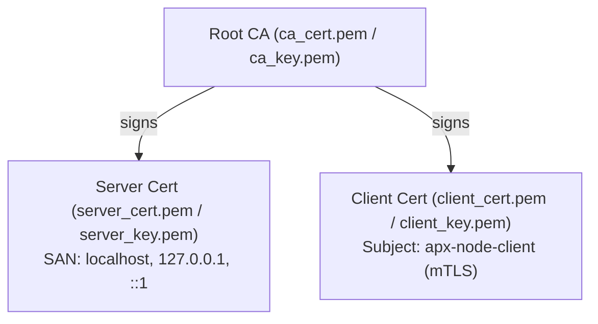

# Test TLS Certificates for APX

These certificates are used for testing APX TLS socket transport and mutual TLS (mTLS) client verification (conforming to Item 6 in `TODO.md`).

## Certificate Hierarchy & Dependencies

The certificates form a standard 2-tier PKI using ECDSA NIST P-256 (`prime256v1`):



### Dependency Chain:
1. **Step 1: Test Root CA (`ca_cert.pem`, `ca_key.pem`)**:
   - Independent (no dependencies).
   - Serves as the trust anchor for both server and client.
2. **Step 2: Server Certificate (`server_cert.pem`, `server_key.pem`)**:
   - **Depends on Step 1**: Signed by `ca_cert.pem` using `ca_key.pem`.
   - Includes Subject Alternative Names (`DNS:localhost`, `IP:127.0.0.1`, `IP:::1`) required by modern TLS stacks.
3. **Step 3: Client Certificate (`client_cert.pem`, `client_key.pem`)**:
   - **Depends on Step 1**: Signed by `ca_cert.pem` using `ca_key.pem`.
   - Contains `extendedKeyUsage = clientAuth` for mutual TLS (mTLS) node verification.

## How to Regenerate

Run the generator script directly:

```bash
./tests/certs/generate_certs.sh
```

Or pass a custom destination folder:

```bash
./tests/certs/generate_certs.sh /path/to/output/dir
```
